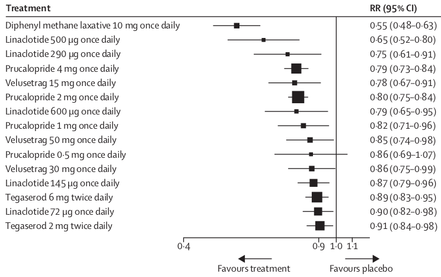
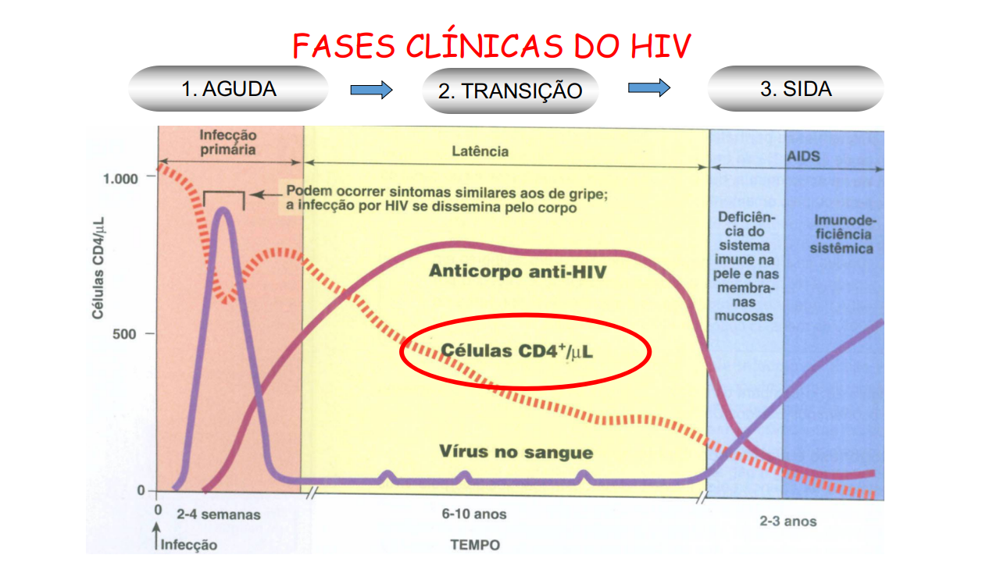

```{r, load_refs, include=FALSE, cache=FALSE}
library(RefManageR)
BibOptions(check.entries = FALSE,
           bib.style = "authoryear",
           cite.style = "authoryear",
           style = "markdown",
           hyperlink = FALSE,
           dashed = FALSE)
bib <- ReadBib("config_files/library.bib", check = FALSE)
```


### PDI na indústria farmacêutica

.large[
* Medicamentos e Vacinas
* Diagnóstico
* Formas Farmacêuticas
* Terapias gênicas e celulares
]

<br>

<span style="position: relative; float: right">
```{r echo = FALSE, out.height=325, out.width=600}

```
</span>

---

### Eficácia de Tratamento

```{r echo = FALSE}

```

.small[`r Citep(bib, "Luthra2019")`]
---

.pull-left[
### Perguntas<br>(quase sempre)<br>sem resposta
]

.pull-right[
```{r echo = FALSE}

```
]

<hr>


.large[

* Qual a probabilidade de o __tratamento A ser melhor em média do que o tratamento B__?

]
--

.large[

* Qual a probabilidade de o tratamento B ter um __efeito médio maior do que 0__?
]

--

.large[
* Qual a probabilidade de o tratamento B estar dentro da __faixa terapêutica__?
]

--

.large[
* Qual a probabilidade de o tratamento B levar a uma __piora clínica__?
]

---

## Por que não temos respostas sob estatística clássica?

--

### Efeitos médios são .red[números]
### Não têm .red[distribuição de probabilidade]

--


$$
P(\text{A melhor em média que B}) = \begin{cases} 
      1 & \mu_A > \mu_B \\\
      0 & \text{caso contrário} 
   \end{cases}
$$ 

<br><br>

.small[
<sup>*</sup> supondo que ambos se encontram dentro da faixa terapêutica
]

---
class: inverse, center, middle

## Como ter uma ideia sobre os valores possíveis dos meus parâmetros em termos de <i style="color: blue">PROBABILIDADE</i> ?

<br><br>

### Tratar $\mu_A$ e $\mu_B$ como <i style="color: blue">variáveis aleatórias</i>.

---
class: inverse, center, middle

# Inferência Bayesiana:
### quantificação probabilística da incerteza


---

### Bayesian update

$$\color{red}{f(\theta|x)} \propto  \color{#3200C3}{f(x|\theta)f(\theta)}$$
.important_equation_large[
$$
\color{red}{posterior} \propto \color{#3200C3}{likelihood} \cdot \color{#3200C3}{prior}
$$
]


.center[
<b>_Bayesian inference is reallocation of credibility across possibilities_ </b>(Kruschke, 2014)  
]

--

```{r setup, include=FALSE}
knitr::opts_chunk$set(
  message = FALSE, warning = FALSE, highlight = TRUE, comment = "", dpi=300 
)
options(htmltools.dir.version = FALSE)
suppressPackageStartupMessages({
  library(tidyverse)
  library(brms)
  library(tidybayes)
})
theme_set(theme_bw())
```


```{r echo=FALSE, fig.height=4, fig.width=13}

## adapted code from https://bookdown.org/content/3686/bayes-rule.html#influence-of-prior-on-the-posterior.

bernoulli_likelihood <- function(theta, data) {
  
  # `theta` = success probability parameter ranging from 0 to 1
  # `data` = the vector of data (i.e., a series of 0s and 1s)
  n   <- length(data)
  
  return(theta^sum(data) * (1 - theta)^(n - sum(data)))
  
}

large_data <- rep(0:1, times = c(30, 10))

d <- tibble(
  theta = seq(from = 0, to = 1, by = .001),
  Prior = c(seq(from = 0, to = 1, length.out = 501),
            seq(from = 0.998, to = 0, length.out = 500))) %>% 
  mutate(Prior = Prior / sum(Prior),
         # the likelihood takes the data and a series of possible thetas
         Likelihood = bernoulli_likelihood(theta = theta,
                                           data  = large_data)) %>% 
  mutate(Prior = Prior^10) %>% # just so we get an abitrarily weird prior
  mutate(marginal_likelihood = sum(Prior * Likelihood)) %>% 
  mutate(Posterior = (Prior * Likelihood) / marginal_likelihood) %>% 
  select(theta, Prior, Likelihood, Posterior) %>% 
  gather(key, value, -theta) %>% 
  mutate(key = factor(key, levels = c("Prior", "Likelihood", "Posterior")))
post_mean <- d %>%
  filter(key == "Posterior") %>%
  summarise(m = sum(theta * value)) %>%
  as.vector() %>%
  round(4)

d %>%
  ggplot(aes(x = theta, ymin = 0, ymax = value)) +
  geom_ribbon(fill = "#7D1900") +
  scale_x_continuous(expression(theta), breaks = seq(from = 0, to = 1, by = .2)) +
  labs(y = "probability density") +
  theme(
    strip.text = element_text(size = 24, face = "bold"),
    axis.title.x = element_text(size = 30, face = "italic"),
    axis.title.y = element_text(size = 22, face = "bold"),
    axis.text.x = element_text(size = 22)
  ) +
  facet_wrap(~key, scales = "free_y", ncol = 3)
```

$\hat{\theta}_{MLE}=$ `r round(mean(large_data), 4)` vs $\hat{\theta}_{Bayes}=$ `r post_mean`

---

class: inverse, middle, center

# Adorei!

## Cadê o R?

---
```{r}
library(tidyverse)
virus <- read_tsv("../data/virus.tsv")
head(virus)
```

---


---

```{r fig.height=4.5, fig.width=6.5, out.width="70%"}
library(ggpubr)
comparacoes_teste_t <- lapply(
  1:4, function(i) c("Controle", paste0("Tratamento ", i))
)

ggplot(data = virus, aes(x = grupo, y = carga_viral, fill = grupo)) +
  geom_boxplot() + 
  stat_compare_means(method = "aov") + #<<
  stat_compare_means(method = "t.test", comparisons = comparacoes_teste_t) + #<<
  theme(axis.text.x = element_text(size = 13, angle = 45, hjust = 1)) +
  ylim(0, 12) +
  labs(y = "Carga Viral", x = NULL, fill = NULL)
```

---

```{r}
library(kableExtra)
fit_ols <- lm(carga_viral ~ grupo, data = virus)
summary(fit_ols)$coefficients %>%
  kable()
```


---

```{r fig.height=4.5, fig.width=6.5, out.width="90%"}
library(sjPlot)
plot_model(fit_ols) +
  theme(axis.text = element_text(size = 14, face = "bold"))
```

---

## Modelo Bayesiano Análogo

Seja $Y_i$ a carga viral da observação $i$. $\beta_0$ denota a carga média do grupo controle e $1(C)$ vale $1$ se a condição $C$ for verdade e $0$ caso contrário. Então:

$Y_i \sim \mathcal{N}(\mu_i, \sigma^2)$

$\mu_i = \beta_0 + \sum_{j=1}^{J} \beta_j \cdot 1(x_i = j)$

Usamos as priors conservadoras:

$\beta_0 \sim \mathcal{N}(5, 1)$

$\beta_j \sim \mathcal{N}(0, 1) \text{ para j = 1, 2, ..., J}$

$\sigma \sim \mathcal{Exp}(1)$

---
class: inverse, middle, center

## APÊNDICE

---

## Te lembras?

$$P(A \cap B)$$
--

$$P(A \cap B) = \color{#3200C3}{P(A|B)P(B)}$$

--

$$\color{red}{P(B|A)P(A)} =P(A \cap B) = \color{#3200C3}{P(A|B)P(B)}$$
--

$$\color{red}{P(B|A)P(A)} = \color{#3200C3}{P(A|B)P(B)}$$

--

### Teorema de Bayes:

.important_equation[
$$\color{red}{P(B|A)} = \frac{\color{#3200C3}{P(A|B)P(B)}}{\color{red}{P(A)}}$$
]


---

.important_equation[
$$\color{red}{P(B|A)} = \frac{\color{#3200C3}{P(A|B)P(B)}}{\color{red}{P(A)}}$$
]

--

$X \sim F_0$

.left-column[
#### Modelo Estatístico

#### Distribuição de $\theta$
]

.right-column[
$\mathcal{F} = \{\color{#3200C3}{f(x|\theta)}: \theta \in \Theta\}, x \in \mathcal{X} \quad$
]

.right-column[
$\color{red}{f(\theta|x)}$ (parâmetro é tratado como __variável aleatória__)
]


--

<br /><br /><br /><br /><br /><br /><br /><br />

.important_equation_large[
$$
\color{red}{f(\theta|x)} = \frac{\color{#3200C3}{f(x|\theta)f(\theta)}}{\color{red}{f(x)}}
\propto  \color{#3200C3}{f(x|\theta)f(\theta)}
$$
]

<span style="position: relative; right: 10rem; bottom: 0.5rem; font-size: 18px">
*Os elementos de $\mathcal{F}$ são candidatos a $F_0$
</span>


